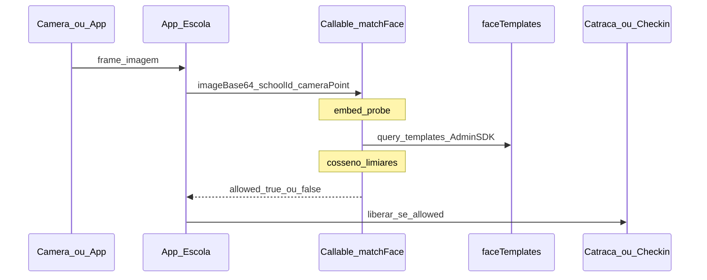

# Face-check seguro — fluxo escola (SIM/NÃO)

## Princípio de segurança

Embeddings são **dado biométrico sensível**. A escola **não** faz GET na galeria de vetores.

| Quem | Vê embedding? | Vê o quê |
|------|---------------|----------|
| Browser / app escola | Não | Só `allowed: true\|false` (+ outcome, studentId se SIM) |
| Cloud Functions (Admin SDK) | Sim (interno) | Lê/escreve `faceTemplates` |
| Firestore Rules | — | `faceTemplates` **deny all** no client |

## Rotas (Firebase Callable — região `southamerica-east1`)

### `enrollFace`
- **Quem:** responsável do aluno, admin escola, admin geral  
- **Entrada:** `{ studentId, schoolId, imageBase64 }`  
- **Efeito:** gera embedding no server, grava template, zera `photoUrl`, atualiza `faceEnrolled`  
- **Saída:** `{ ok, faceEnrolled, requestId, message }` — **sem vetor**  
- Imagem existe só na request HTTPS (não vai para Storage)

### `matchFace` (face-check)
- **Quem:** staff (operador / admin escola / admin geral)  
- **Entrada:** `{ schoolId, cameraPointId, cameraPointKind?, imageBase64? }`  
  - Demo: `asStudentId` no lugar da imagem; `forceNoMatch` para testar NÃO  
- **Saída pública:**

```json
{
  "allowed": true,
  "outcome": "allow",
  "studentId": "abc",
  "confidence": 0.91,
  "requestId": "fc_…",
  "message": "SIM — identidade confirmada…"
}
```

| `allowed` | `outcome` | Ação típica da escola |
|-----------|-----------|------------------------|
| `true` | `allow` | Liberar catraca **ou** check-in diário |
| `false` | `deny` | Negar / fallback manual |
| `false` | `review` | Fila humana, sem auto-liberar |
| `false` | `not_enrolled` | Cadastrar rosto antes |
| `false` | `error` | Falha técnica |

### `deleteFaceEnrollment`
- LGPD / revogação: apaga templates do aluno (sem devolver vetores)

## Fluxo ponta a ponta



1. Escola captura frame  
2. App chama **somente** `matchFace`  
3. Function vetoriza o frame, compara com templates da escola  
4. Responde **SIM/NÃO** (e `studentId` só se SIM, para gravar movimento/avisar pais)  
5. Escola decide o mecanismo (catraca, check-in, etc.)

## Auditoria

Coleção `faceAuditLogs` (escrita só pela Function): `action`, `actorUid`, `schoolId`, `outcome`, `allowed` — **sem** embedding e **sem** imagem. Leitura: admin geral.

## Deploy

```bash
cd functions && npm install && npm run build
firebase deploy --only functions,firestore:rules --project renato-29b68
```

**Plano Blaze obrigatório** para Cloud Functions. Até o upgrade:

1. Rules já bloqueiam GET/write de `faceTemplates` no client  
2. Hosting chama Callables — enroll/match retornam erro claro se Functions não existirem  
3. Ative Blaze: https://console.firebase.google.com/project/renato-29b68/usage/details  
4. Rode `firebase deploy --only functions`

Não reabrir leitura de embeddings no client como “atalho”.
